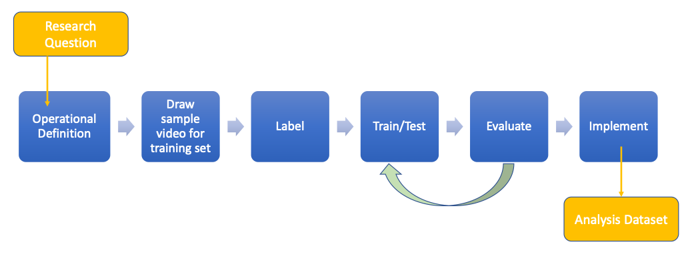

Project Description: 
The goal of this project is to develop automated, unbiased algorithms for extracting data from video. 
Current data extraction strategies primarily use human coders. While human coders are generally accurate at 
correctly identifying objects and behaviors, automated algorithms have potential to reduce expense, increase speed, 
and decrease bias. The project will focus on developing strategies for automoting video data extraction to records occupant 
behavior, as well as objects and actions in the vehicle’s forward view.
However, techniques could be extended to other research areas that collect data using video. 

One element of the project will involve evaluation of the process used by human coders, 
including recording eye gaze as they code videos. Another component of the project will identify strategies for selecting 
video training sets that prevent the algorithms from developing bias. The project will also investigate how context provided 
by other datasets could be used to increase accuracy and speed of algorithms. 

The process of developing and implementing computer vision algorithms contains many component 
steps and each step raise a host of interesting technological challenges and research questions. 
Our program is organized around these steps:

